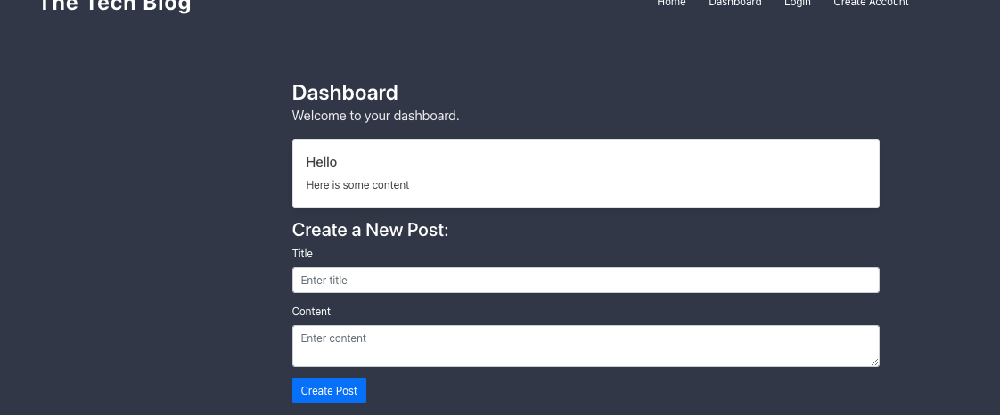
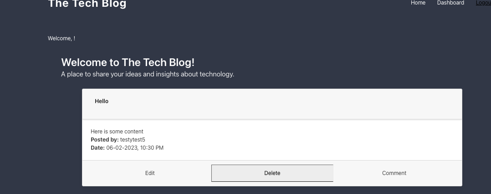

# MVC_Tech_Blog

This project uses the following technologies:

- Express
- MYSQL2
- Sequelize
- Handlebars
- express-handlebars
- dotenv
- bycrypt
- express-session
- connect-session-sequelize
- Heroku

## Description

This is a CMS-style blog site built for developers to publish their blog posts and engage in discussions by commenting on other developers' posts. The site follows the Model-View-Controller (MVC) architectural pattern and incorporates technologies such as Handlebars.js, Sequelize, and express-session for authentication. The application is deployed on Heroku.

here is the link to the deployed application on Heroku: [Click Here]()

## Table of Contents

- [Installation](#installation)
- [Usage](#usage)
- [Credits](#credits)
- [Tests](#tests)

## Installation

1.  Clone the repository.
2.  Install the required dependencies using the command npm install.
3.  Create a MySQL database.
4.  Create a .env file in the root directory and provide the following environment variables:

                DB_NAME=your_database_name
                DB_USER=your_mysql_username
                DB_PASSWORD=your_mysql_password

Review the code on the GitHub repository by visiting the [GitHub Repository](https://github.com/etapm/M19_TextEditor).

## Usage

1.  To start the application, navigate to the project root directory and run `npm start`.

2.  Open your browser and go to http://localhost:3002.

3.  On the homepage, you will see existing blog posts (if any), navigation links for the homepage and the dashboard, and the option to log in.

4.  Click on the "Sign Up" option if you are a new user and create a username and password.

5.  After signing up, you will be logged into the site automatically. If you are a returning user, click on the "Sign In" option and enter your username and password.

6.  Once signed in, you will see navigation links for the homepage, dashboard, and the option to log out.
7.  Click on the "Homepage" option in the navigation to view existing blog posts. The posts will be displayed with their titles and creation dates.

8.  Click on an existing blog post to view its full details, including the post title, contents, post creator's username, and date created. You can also leave a comment on the post if desired.

9.  To create a new blog post, click on the "Dashboard" option in the navigation. Here, you can view your existing blog posts and add a new one.
    
10. Click on the button to add a new blog post and enter a title and contents for your post.

11. Click on the button to create the new blog post. It will be saved, and you will be redirected to an updated dashboard showing your new post.
    
12. In the dashboard, you can also delete or update your existing posts by clicking on the corresponding options.
13. To log out of the site, click on the "Log Out" option in the navigation.

## Credits

N/A

## License

This project is licensed under the ISC License.

## Badges

N/A

## Features

N/A

## How to Contribute

N/A

## Tests

N?A
